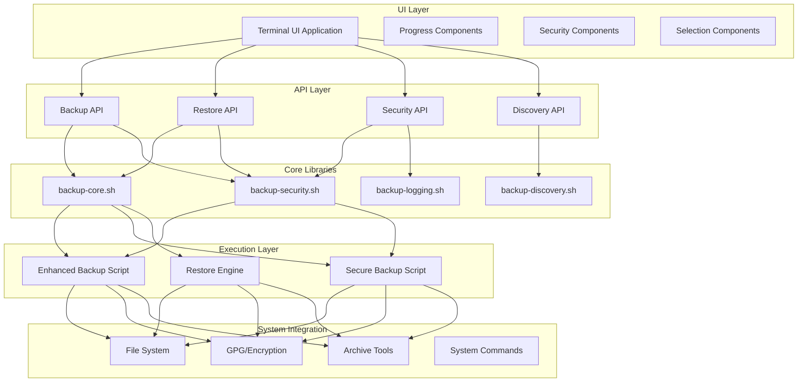
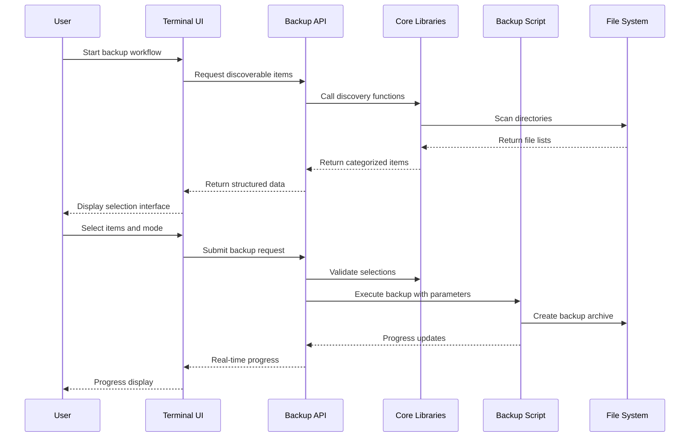

# Backup/Restore UI System - Design Document

## Executive Summary

This document presents the comprehensive design for a modern, secure UI system that enhances the existing bash-based backup and restore tools with user-friendly interfaces while maintaining security-first principles and leveraging the proven bash script infrastructure.

### Key Architectural Decisions

- **Terminal-based UI** using Rust TUI for security, performance, and zero web dependencies
- **Modular Backend Architecture** with extracted bash library functions and JSON API interfaces
- **Security-First Design** with secure password handling, memory management, and strict permission controls
- **Progressive Enhancement** approach that preserves existing script functionality while adding UI capabilities

### Implementation Timeline

- **Phase 1** (4-6 weeks): Backend modularization and API development
- **Phase 2** (3-4 weeks): Core UI framework and components
- **Phase 3** (2-3 weeks): Backup workflow implementation
- **Phase 4** (2-3 weeks): Restore workflow implementation
- **Phase 5** (1-2 weeks): Integration testing and security audit

## System Architecture

### High-Level Architecture



### Component Interactions

The system follows a layered architecture with clear separation between UI presentation, business logic, and system operations:

1. **UI Layer**: Handles user interaction, input validation, and display
2. **API Layer**: Provides structured interfaces between UI and core functionality
3. **Core Libraries**: Modular bash functions for backup operations, security, and discovery
4. **Execution Layer**: Enhanced versions of existing scripts with API compatibility
5. **System Integration**: Direct system tool integration (tar, gpg, filesystem operations)

### Data Flow Architecture



## Technical Specifications

### Technology Stack

#### Primary Technology Selection: Rust + TUI Framework

**Framework**: `ratatui` (Rust TUI library)

**Justification**:
- **Security**: No network dependencies, compiled binary, memory safety
- **Performance**: Native performance, minimal resource usage
- **Terminal Integration**: Rich terminal UI capabilities with cross-platform support
- **Ecosystem**: Strong Rust ecosystem for security, JSON handling, and system integration
- **Maintenance**: Type safety and tooling reduce long-term maintenance burden

**Alternative Considered**: Python with `textual` framework
- **Rejected**: Runtime dependency management complexity and security implications

#### Backend Technology Stack

**Core Language**: Bash (preserving existing investment)
**API Interface**: JSON-based communication via stdout/stderr
**Security**: GPG integration, secure memory handling patterns
**Logging**: Structured logging with security-conscious design
**Archive Format**: tar.gz with optional GPG encryption

### Data Models

#### Configuration Model

```json
{
  "backup_config": {
    "mode": "secure" | "complete",
    "selected_items": [
      {
        "path": "/home/user/.ssh",
        "category": "credentials",
        "size_estimate": 1024,
        "security_level": "high",
        "included": true
      }
    ],
    "encryption": {
      "enabled": true,
      "method": "gpg" | "builtin"
    },
    "output": {
      "path": "/path/to/backup.tar.gz",
      "permissions": "600"
    }
  }
}
```

#### Progress Model

```json
{
  "progress": {
    "phase": "discovery" | "archiving" | "encryption" | "verification",
    "current_item": "/path/to/current/file",
    "items_processed": 45,
    "total_items": 127,
    "bytes_processed": 1048576,
    "estimated_total_bytes": 5242880,
    "percentage": 67.5,
    "eta_seconds": 23,
    "can_cancel": true
  }
}
```

#### Error Model

```json
{
  "error": {
    "type": "permission" | "disk_space" | "encryption" | "corruption",
    "severity": "warning" | "error" | "critical",
    "message": "Human-readable description",
    "technical_details": "Technical error information",
    "suggested_actions": ["Try action 1", "Try action 2"],
    "recoverable": true
  }
}
```

### API Specification

#### Backup API Interface

**Discovery Endpoint**
```bash
./backup-api.sh discover [--mode=secure|complete] [--path=/custom/path]
```

**Response**:
```json
{
  "status": "success",
  "discoverable_items": [
    {
      "path": "/home/user/.ssh",
      "category": "credentials",
      "description": "SSH keys and configuration",
      "size_estimate": 2048,
      "security_level": "high",
      "default_included": false,
      "warnings": ["Contains private keys"]
    }
  ],
  "categories": {
    "credentials": {"count": 3, "total_size": 5120},
    "dotfiles": {"count": 15, "total_size": 51200}
  }
}
```

**Backup Execution Endpoint**
```bash
./backup-api.sh execute --config=/path/to/config.json [--progress-fd=3]
```

**Progress Output** (via file descriptor):
```json
{"progress": {"phase": "archiving", "percentage": 45.2, ...}}
```

#### Restore API Interface

**Archive Inspection**
```bash
./restore-api.sh inspect --archive=/path/to/backup.tar.gz [--password-fd=3]
```

**Restore Execution**
```bash
./restore-api.sh execute --archive=/path/to/backup.tar.gz --config=/path/to/restore-config.json
```

### Security Architecture

#### Password Handling Strategy

**Memory Management**:
- Passwords read into secure memory regions (mlock where available)
- Immediate zeroing of password buffers after use
- No password logging or disk persistence
- Process memory protection against swapping

**Password Strength Validation**:
- Minimum length enforcement (12 characters)
- Character set diversity requirements
- Common password dictionary checking
- Entropy calculation and feedback

**Secure Communication**:
- Password transmission via file descriptors
- No command-line argument exposure
- Environment variable isolation
- Parent process cleanup on termination

#### Encryption Implementation

**GPG Integration**:
- Symmetric encryption with user-provided passwords
- Key derivation using PBKDF2 with high iteration counts
- Cipher preference for AES-256
- Integrity verification with digital signatures

**Archive Security**:
- Secure file permissions (600) for all output
- Temporary file cleanup with secure deletion
- Atomic operations to prevent partial writes
- Verification checksums for archive integrity

#### Access Control

**File System Permissions**:
- All created files default to 600 (owner read/write only)
- Directory traversal prevention
- Symlink attack protection
- Path validation and sanitization

**Process Security**:
- Privilege separation where possible
- Signal handling for secure cleanup
- Resource limits to prevent DoS
- Audit logging of security-relevant operations

## UI/UX Design

### Core UI Principles

1. **Security-First UX**: Security options prominent and well-explained
2. **Progressive Disclosure**: Complex options hidden behind clear progressions
3. **Clear Mental Models**: Users understand what's happening and why
4. **Error Recovery**: Clear paths forward when things go wrong

### Screen Flow Design

#### Main Menu
```
┌─ Custom Tools - Backup/Restore System ─────────────────────────┐
│                                                                │
│  [B] Create New Backup                                         │
│  [R] Restore from Backup                                       │
│  [V] View Backup History                                       │
│  [S] Settings & Configuration                                  │
│  [Q] Quit                                                      │
│                                                                │
│                                                                │
│  Navigation: Use arrow keys or letter shortcuts               │
│  Status: Ready                                                │
└────────────────────────────────────────────────────────────────┘
```

#### Backup Mode Selection
```
┌─ Select Backup Mode ────────────────────────────────────────────┐
│                                                                │
│  Mode Selection:                                               │
│  (*) Secure Mode (Recommended)                                 │
│      • Excludes sensitive credentials                          │
│      • Safe for cloud storage                                  │
│      • Includes: dotfiles, configs, documents                  │
│                                                                │
│  ( ) Complete Mode                                             │
│      ⚠️  WARNING: Includes sensitive data                       │
│      • SSH private keys, GPG keys, credentials                 │
│      • Requires secure storage and handling                    │
│      • Includes: everything from secure mode + credentials     │
│                                                                │
│                                                                │
│  [Continue] [Cancel]                                           │
│                                                                │
│  💡 Tip: Start with Secure Mode for your first backup          │
└────────────────────────────────────────────────────────────────┘
```

#### Item Selection Interface
```
┌─ Select Items to Backup ────────────────────────────────────────┐
│                                                                │
│  Dotfiles & Configuration (15 items, ~51KB)              [+]   │
│    [✓] .bashrc, .profile, .vimrc                              │
│    [✓] .gitconfig, .ssh/config                               │
│    [ ] .history files (may contain sensitive data)            │
│                                                                │
│  Documents & Data (47 items, ~2.1MB)                     [+]   │
│    [✓] ~/Documents                                             │
│    [✓] ~/Desktop                                               │
│    [ ] ~/Downloads (temporary files)                          │
│                                                                │
│  Development (23 items, ~156KB)                          [+]   │
│    [✓] Project configurations                                 │
│    [ ] node_modules, .git directories                         │
│                                                                │
│                                                                │
│  Total: 85 items, ~2.31MB                                     │
│  [Select All] [Deselect All] [Continue] [Back]                │
└────────────────────────────────────────────────────────────────┘
```

#### Password Entry
```
┌─ Backup Encryption ─────────────────────────────────────────────┐
│                                                                │
│  🔒 Your backup will be encrypted for security                 │
│                                                                │
│  Enter encryption password:                                    │
│  ████████████████                                              │
│                                                                │
│  Confirm password:                                             │
│  ████████████████                                              │
│                                                                │
│  Password strength: ████████░░ Strong                         │
│                                                                │
│  💡 Tips:                                                      │
│     • Use a strong, memorable password                        │
│     • Store password securely - it cannot be recovered        │
│     • Consider using a password manager                       │
│                                                                │
│  [Continue] [Generate Password] [Cancel]                       │
└────────────────────────────────────────────────────────────────┘
```

#### Progress Display
```
┌─ Creating Backup ───────────────────────────────────────────────┐
│                                                                │
│  Phase: Archiving files                                        │
│  Progress: ████████████░░░░░░░░ 67% (45/85 items)             │
│                                                                │
│  Current: /home/user/.config/git/config                       │
│  Speed: 2.1 MB/s                                              │
│  ETA: 23 seconds                                               │
│                                                                │
│  Details:                                                      │
│    ✓ Dotfiles collection completed                            │
│    🔄 Processing configuration files...                        │
│    ⏳ Encryption pending                                       │
│    ⏳ Verification pending                                     │
│                                                                │
│                                                                │
│  [Cancel] [Hide Details]                                       │
└────────────────────────────────────────────────────────────────┘
```

### State Management Approach

#### Application State Structure

```rust
pub struct AppState {
    pub current_screen: Screen,
    pub backup_config: BackupConfig,
    pub restore_config: RestoreConfig,
    pub progress: Option<ProgressState>,
    pub error_state: Option<ErrorState>,
    pub security_warnings: Vec<SecurityWarning>,
}

pub enum Screen {
    MainMenu,
    BackupModeSelection,
    BackupItemSelection,
    BackupPasswordEntry,
    BackupProgress,
    RestoreArchiveSelection,
    RestorePasswordEntry,
    RestoreItemSelection,
    RestoreProgress,
    Settings,
    Error(ErrorScreen),
}
```

#### State Transitions

State management follows a unidirectional data flow pattern:

1. **User Action** → **Command** → **State Update** → **UI Render**
2. **Backend Event** → **Event Handler** → **State Update** → **UI Render**
3. **Error Condition** → **Error Handler** → **Error State** → **Error UI**

#### Persistence Strategy

- **Session State**: In-memory only, cleared on exit
- **Configuration**: Optional persistent settings (UI preferences, default paths)
- **Audit Log**: Persistent, security-conscious logging of operations
- **No Sensitive Data Persistence**: Passwords and credentials never written to disk

## Error Handling and Recovery Strategy

### Error Classification System

#### Error Types and Severity Levels

**User Errors** (Recoverable)
- Invalid password entries → Retry with guidance
- Insufficient disk space → Prompt for different location
- Permission denied → Provide resolution steps

**System Errors** (Partially Recoverable)
- Archive corruption → Offer partial recovery options
- Network interruption → Retry mechanisms
- Tool dependency missing → Installation guidance

**Security Errors** (Immediate Attention)
- Encryption failure → Abort with secure cleanup
- Permission escalation attempt → Log and terminate
- Integrity verification failure → Alert and quarantine

### Recovery Mechanisms

#### Graceful Degradation
- **Primary Tool Failure**: Automatic fallback to alternative implementations
- **Partial Progress Loss**: Resume from last checkpoint where possible
- **UI Component Failure**: Fallback to command-line interface

#### User Guidance
- **Contextual Help**: Error-specific guidance and next steps
- **Progressive Solutions**: Start with simple fixes, escalate if needed
- **Learning Opportunities**: Explain why errors occurred and how to prevent them

#### Cleanup and Safety
- **Automatic Cleanup**: Remove partial files on failure
- **Secure Deletion**: Overwrite sensitive temporary data
- **State Recovery**: Return to last stable state

### Error Communication

#### Error Display Strategy
```
┌─ Error: Backup Failed ──────────────────────────────────────────┐
│                                                                │
│  ❌ Unable to create backup archive                             │
│                                                                │
│  Problem: Insufficient disk space                              │
│  Location: /home/user/backup.tar.gz                           │
│  Required: 2.3 GB                                             │
│  Available: 1.1 GB                                            │
│                                                                │
│  What you can do:                                             │
│  • [Choose Different Location]                                │
│  • [Remove Some Items from Backup]                            │
│  • [Free Up Disk Space]                                       │
│  • [View Detailed Error Log]                                  │
│                                                                │
│  [Retry] [Back to Selection] [Cancel]                         │
└────────────────────────────────────────────────────────────────┘
```

## Testing Strategy

### Testing Pyramid Approach

#### Unit Tests (70% coverage target)
- **Core Functions**: All bash library functions
- **Security Components**: Password handling, encryption, permissions
- **Data Validation**: Input sanitization, path validation
- **Error Handling**: All error conditions and recovery paths

#### Integration Tests (20% coverage target)
- **UI-API Integration**: All UI interactions with backend APIs
- **Script Compatibility**: UI-generated calls match manual script usage
- **Cross-Platform**: Terminal compatibility across different systems
- **Performance**: Response time and resource usage under normal conditions

#### End-to-End Tests (10% coverage target)
- **Complete Workflows**: Full backup and restore cycles
- **Error Scenarios**: Simulated failures and recovery testing
- **Security Validation**: Complete security workflow testing
- **User Acceptance**: Real-world usage patterns and edge cases

### Security Testing Framework

#### Automated Security Tests
- **Static Analysis**: Code scanning for security vulnerabilities
- **Dynamic Analysis**: Runtime security behavior validation
- **Penetration Testing**: Attack simulation against security measures
- **Compliance Verification**: SECURITY.md requirements validation

#### Manual Security Review
- **Code Review**: Expert review of security-critical components
- **Architecture Review**: Overall security design validation
- **Threat Modeling**: Attack surface analysis and mitigation verification
- **Documentation Review**: Security documentation accuracy and completeness

### Performance Testing

#### Benchmark Targets
- **UI Responsiveness**: <100ms for all user interactions
- **Backup Performance**: Within 10% of direct script performance
- **Memory Usage**: <50MB resident memory during operation
- **Startup Time**: <2 seconds from launch to ready state

#### Load Testing
- **Large Backups**: >10GB archive creation and restoration
- **Many Files**: >10,000 individual files handling
- **Concurrent Usage**: Multiple backup processes (if supported)
- **Resource Constraints**: Low memory and disk space conditions

## Deployment Considerations

### Installation and Dependencies

#### System Requirements
- **Operating System**: Linux distributions with bash 4.0+
- **Terminal**: ANSI color support, UTF-8 compatibility
- **System Tools**: tar, gpg, sha256sum, standard POSIX utilities
- **Rust Runtime**: No runtime dependencies (statically linked binary)

#### Installation Methods

**Package Manager Installation** (Preferred)
```bash
# Future implementation with system package managers
sudo pacman -S custom-tools-backup-ui  # Arch Linux
sudo apt install custom-tools-backup-ui  # Debian/Ubuntu
```

**Source Installation**
```bash
git clone https://github.com/user/custom-tools.git
cd custom-tools
./install.sh
```

**Single Binary Distribution**
```bash
curl -L https://github.com/user/custom-tools/releases/latest/backup-ui > backup-ui
chmod +x backup-ui
sudo mv backup-ui /usr/local/bin/
```

### Configuration Management

#### Default Configuration
- **Security-first defaults**: Secure mode, strong encryption
- **User-specific paths**: XDG Base Directory specification compliance
- **Logging configuration**: Security-conscious default log levels
- **UI preferences**: Terminal-appropriate defaults

#### Customization Options
- **Config File Location**: `~/.config/custom-tools/backup-ui.conf`
- **Environment Variables**: CT_BACKUP_DEFAULT_MODE, CT_BACKUP_LOG_LEVEL
- **Command-line Overrides**: All config options available as CLI arguments
- **Per-user Customization**: Individual user preference storage

### Update and Maintenance Strategy

#### Version Management
- **Semantic Versioning**: Clear version numbering for compatibility
- **Backward Compatibility**: Maintain API compatibility across minor versions
- **Migration Scripts**: Automated configuration migration for major versions
- **Change Documentation**: Clear changelog with security implications

#### Update Mechanisms
- **Manual Updates**: Package manager or direct download
- **Update Notifications**: Optional version checking with privacy respect
- **Security Updates**: Clear communication channel for security patches
- **Rollback Support**: Ability to revert to previous version if needed

### Security Deployment Considerations

#### File System Security
- **Installation Permissions**: Appropriate file permissions on installation
- **Runtime Permissions**: Minimal required permissions for operation
- **Temporary File Handling**: Secure creation and cleanup of temporary files
- **Audit Trail**: Optional audit logging for security-conscious environments

#### Network Security
- **No Network Dependencies**: Core functionality works offline
- **Update Security**: Secure update mechanisms with signature verification
- **Privacy Protection**: No telemetry or data collection by default
- **Firewall Compatibility**: No inbound network connections required

---

## Implementation Phases and Milestones

### Phase 1: Backend Modularization (4-6 weeks)
**Milestone**: Modular bash libraries with JSON API interfaces

**Deliverables**:
- `lib/backup-core.sh` - Core backup functionality
- `lib/backup-security.sh` - Security and encryption functions
- `lib/backup-discovery.sh` - System discovery and categorization
- `backup-api.sh` - JSON API wrapper for existing scripts
- `restore-api.sh` - JSON API wrapper for restore operations
- Comprehensive test suite for all library functions

### Phase 2: UI Framework (3-4 weeks)
**Milestone**: Core UI framework with navigation and components

**Deliverables**:
- Rust application structure with ratatui integration
- Core UI components (menus, forms, progress indicators)
- Security-conscious password input components
- Error handling and display system
- Basic navigation and state management

### Phase 3: Backup Workflow (2-3 weeks)
**Milestone**: Complete backup workflow from discovery to completion

**Deliverables**:
- System discovery and item categorization UI
- Backup mode selection with security warnings
- Item selection interface with preview and estimation
- Password entry with strength validation
- Progress tracking with real-time updates
- Success/failure result display

### Phase 4: Restore Workflow (2-3 weeks)
**Milestone**: Complete restore workflow with granular control

**Deliverables**:
- Archive selection and validation
- Password entry for encrypted archives
- Archive contents display and preview
- Selective restoration interface
- Conflict resolution for existing files
- Restore progress tracking and validation

### Phase 5: Integration and Security Audit (1-2 weeks)
**Milestone**: Production-ready system with security validation

**Deliverables**:
- Complete integration testing
- Security audit and penetration testing
- Performance optimization and benchmarking
- Documentation completion
- Release preparation and packaging

---

## Conclusion

This design document provides a comprehensive blueprint for creating a modern, secure, and user-friendly backup and restore UI system. The design prioritizes security, maintains compatibility with existing tools, and provides a clear path for implementation and maintenance.

The architecture balances the need for enhanced user experience with the proven reliability of the existing bash script infrastructure. By following this design, the implementation will deliver a tool that meets security requirements while significantly improving usability and reducing the barrier to entry for safe backup and restore operations.

Key success factors include:
- Maintaining security-first principles throughout implementation
- Preserving all existing functionality while enhancing usability
- Following the modular architecture for long-term maintainability
- Implementing comprehensive testing to ensure reliability
- Providing clear documentation and user guidance

The progressive implementation phases ensure that each component is thoroughly tested and validated before integration, reducing risk and ensuring a high-quality final product.